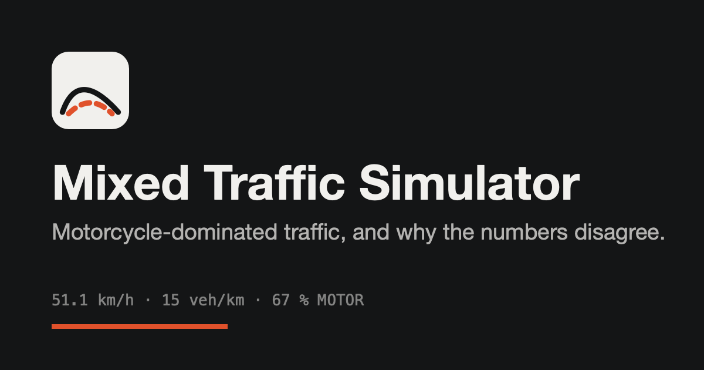
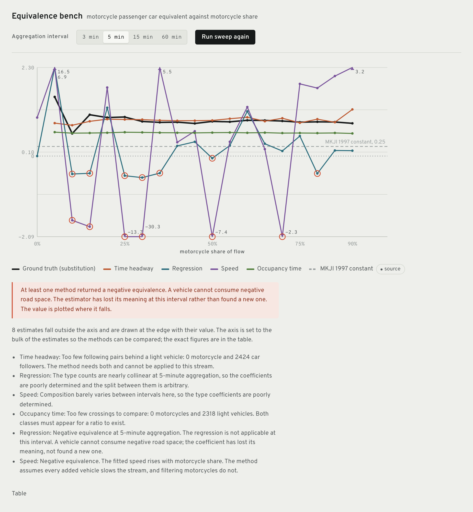
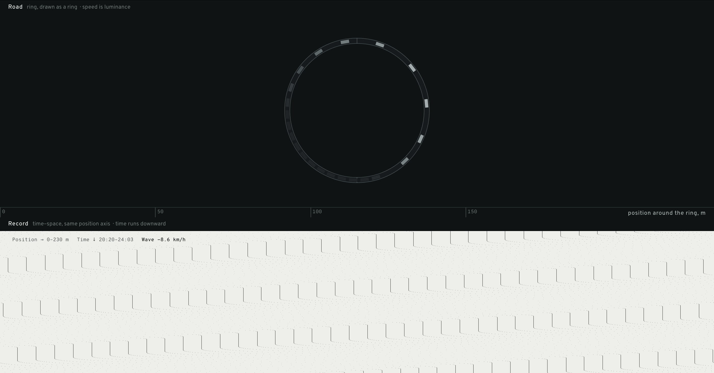

<div align="center">



**Motorcycle-dominated traffic, and why the numbers that describe it disagree.**

[**Open the simulator →**](https://andifathulms.github.io/mixed-traffic-simulator/)

[](https://github.com/andifathulms/mixed-traffic-simulator/actions/workflows/ci.yml)


</div>

---

## The thesis

Indonesian traffic engineering converts every vehicle to passenger car units
using equivalence factors from MKJI 1997, a fixed constant per vehicle type.
Motorcycles get 0.25 or 0.5 depending on road type.

Two decades of field studies have found that constant is not constant.
Published measurements of motorcycle emp include 0.198, 0.32, 0.35, 0.4, 0.84
and, in one Denpasar study using regression, **−0.11 at one-hour aggregation**.
A negative passenger car equivalent is physically meaningless. The estimator
broke, and it broke because of a choice about how long an interval to count
over.

**The equivalence factor everyone quotes is an artefact of the method that
measured it.** This app shows that by simulating a stream, obtaining ground
truth by an experiment no field study can run, and applying each published
method to the same stream using only what a roadside observer could have seen.



<sub>Five methods, one stream, one sweep across motorcycle share. Ground truth
in black is nearly flat. The regression and speed methods swing from +16 to
−30 and cross zero repeatedly. The dashed rule is the constant that Indonesian
practice actually uses.</sub>

## The pairing

The road and the time–space record share one horizontal position axis, pixel
for pixel, with a ruler between them that says so. A jam visible as a dark
patch in the road sits directly above the backward-leaning stripe that is the
same jam in the record.



<sub>Twenty-two vehicles on a 230 m ring at a constant speed, with no
bottleneck and no incident. The jam forms from reaction dynamics alone and
then travels backward forever. The record measures its speed: **−8.6 km/h**.
This reproduces Sugiyama et al. (2008), and it is a build gate rather than a
demo.</sub>

## What makes the comparison honest

`src/estimators/` cannot import from `src/sim/`. A lint rule fails the build if
it tries. The estimators consume `DetectorRecord`, which is a crossing time, a
class judged by eye, a spot speed, an occupancy time and a lateral position,
and nothing else. A method that gets to see true speeds and true vehicle
identities is not the method a field engineer used, and comparing it to one
would be dishonest.

`src/truth/substitution.ts` is the documented exception. It may read the
simulation, because ground truth is explicitly the thing an observer cannot
obtain: the same hour of traffic re-run with the motorcycles replaced by cars.

## Running it

```bash
npm install
npm run dev        # development server
npm test           # engine, estimators, scenarios, interface
npm run lint       # includes the estimator import restriction
npm run typecheck
npm run build
```

## What is checked

| Property | How |
| --- | --- |
| Analytic equilibrium | Simulated acceleration at the closed-form IDM equilibrium gap is zero to 1e-12 |
| Sugiyama reproduction | 22 vehicles on a 230 m ring jam from reaction dynamics alone, then propagate backward |
| Determinism | The same seed produces a bit-identical trajectory |
| Frame-rate independence | Step N is identical however the frames were cut |
| Conservation and non-overlap | Every scenario, every step |
| The shared axis | Road and record place a given position at the same fraction of their width, at any backing store size |
| The estimator boundary | A lint rule, run in CI |

## Reading the interface

Speed is luminance and type is shape, never hue. Hue is spent on the one thing
that needs categorical colour: the five equivalence estimators. Where an
instrument has to separate vehicle types it uses value, not the estimator
palette.

A road is two orders of magnitude longer than it is wide, so the road view
stretches its across-road axis. That stretch is capped and stated in the corner
of the view rather than applied silently.

Every parameter that has a published source carries an inline marker that names
it. The social force lateral rule has no traffic-literature basis, and its
marker says so rather than leaving the field blank.

## Known limits

It is not calibrated to any location and does not claim to be. It is one
corridor and one intersection: no routing, no OD matrices. The lateral rule is
a modelling choice rather than physics, which is why three of them ship and the
active one is named in the interface at all times.

Two rare overlap cases remain, both reported as specific numerical warnings
rather than drawn as vehicles inside each other: vehicles squeezed below their
own width in a signal queue, and the sublane rule occasionally leaving a car
0.7 m inside a stopped angkot when there was room to clear it.

## Documents

`PRD.md` is what and why. `DESIGN.md` is how it looks. `CLAUDE.md` is how it is
built.
